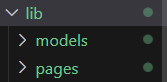
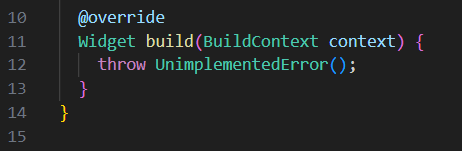
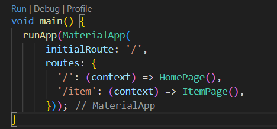
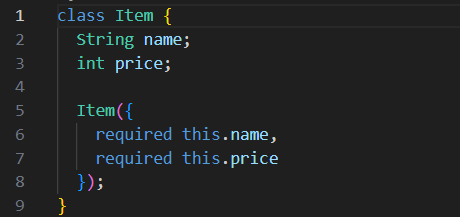
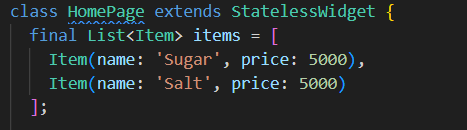

## Nama : M . Rizky Mafazan
## NIM : 2141720140
## Kelas : 3F
#
#

# Week 8 - Navigasi

### Membangun Navigasi di Flutter
Langkah 1 : Siapkan project baru

Langkah 2 : Mendefinisikan Route

Langkah 3 : Lengkapi Kode di main.dart

Langkah 4 : Membuat data model

Langkah 5 : Lengkapi kode di class HomePage

Langkah 6 : Membuat ListView dan itemBuilder

Langkah 7 : Menambahkan aksi pada ListView

# Tugas Praktikumm