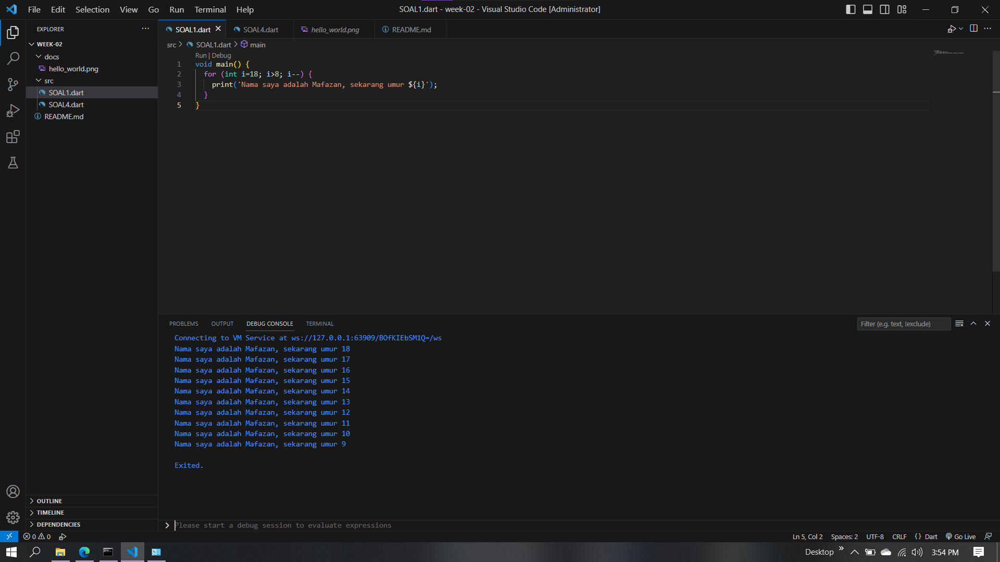

# 2141720140-mobile-2023
# M. Rizky Mafazan
# 3F
# 16

## Soal 1
Modifikasilah kode pada baris 3 di VS Code atau Editor Code favorit Anda berikut ini agar mendapatkan keluaran (output) sesuai yang diminta!

## Soal 2
Mengapa sangat penting untuk memahami bahasa pemrograman Dart sebelum kita menggunakan framework Flutter ? Jelaskan!

>Karena Flutter menggunakan bahasa pemrograman Dart sebagai bahasa utama untuk mengembangkan aplikasi mobile, dengan memahami bahasa pemrograman Dart, Anda akan lebih mudah memahami konsep-konsep dasar dalam Flutter dan dapat membuat aplikasi mobile dengan lebih mudah dan cepat

## Soal 3
Rangkumlah materi dari codelab ini menjadi poin-poin penting yang dapat Anda gunakan untuk membantu proses pengembangan aplikasi mobile menggunakan framework Flutter.     

>- Arithmetic operators  
Dart hadir dengan banyak operator typical yang bekerja seperti banyak bahasa pemrograman lainnya; yaitu sebagai berikut : 
 (+) untuk tambahan.
 (-) untuk pengurangan.
 (*) untuk perkalian.
 (/) untuk pembagian.
 (~/) untuk pembagian bilangan bulat. Di Dart, setiap pembagian sederhana dengan / menghasilkan nilai double. Untuk mendapatkan nilai bilangan bulat, Anda perlu membuat semacam transformasi (yaitu, typecast) dalam bahasa pemrograman lain; namun Dart sudah mendukung untuk operasi ini.
 (%) untuk operasi modulus (sisa bagi dari bilangan bulat).
 (-expression) untuk negasi (yang membalikkan suatu nilai).

## Soal 4
Buatlah slide yang berisi penjelasan dan contoh eksekusi kode tentang perbedaan Null Safety dan Late variabel ! (Khusus soal ini kelompok berupa link google slide)

<Link>