# 2141720140-mobile-2023
# M. Rizky Mafazan
# 3F
# 16
  

## Praktikum 1: Menerapkan Control Flows ("if/else")
 
Selesaikan langkah-langkah praktikum berikut ini menggunakan DartPad di browser Anda.

Langkah 1: Ketik atau salin kode program berikut ke dalam fungsi main().

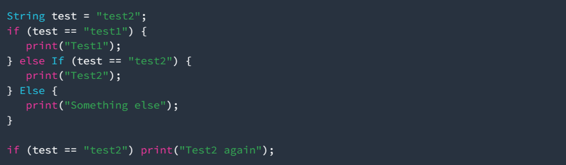

Langkah 2: Silakan coba eksekusi (Run) kode pada langkah 1 tersebut. Apa yang terjadi? Jelaskan!
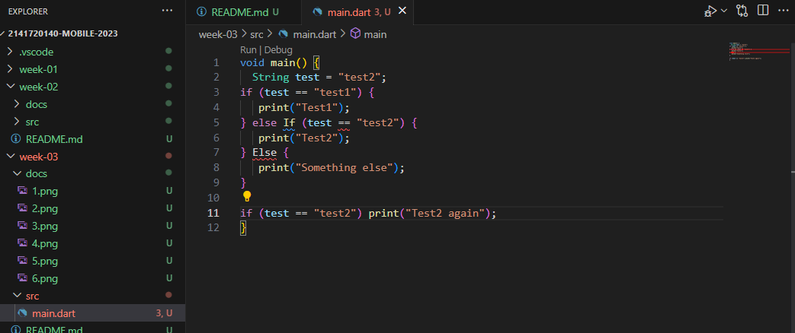
> Terdapat kesalahan pada penulisan if else, yang seharusnya menggunakan huruf kecil 
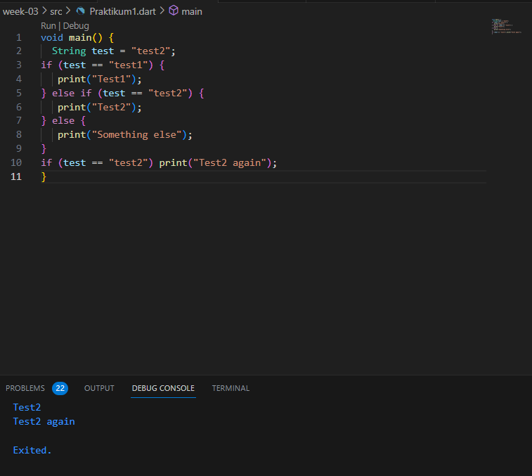

Langkah 3:
Tambahkan kode program berikut, lalu coba eksekusi (Run) kode Anda.

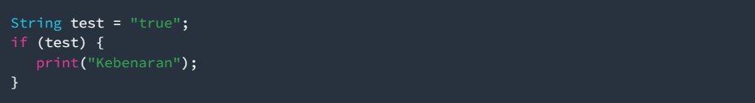
Apa yang terjadi ? Jika terjadi error, silakan perbaiki namun tetap menggunakan if/else.
>Kode diatas error karena data pada string belum diperintah ke boolean, kode diperbaiki dengan menambahkan '=='
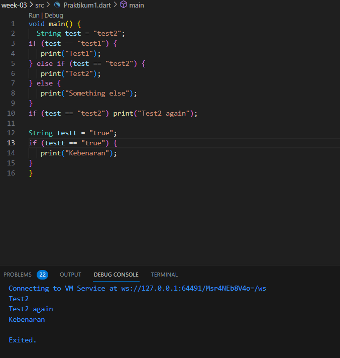

## Praktikum 2: Menerapkan Perulangan "while" dan "do-while"
Selesaikan langkah-langkah praktikum berikut ini menggunakan DartPad di browser Anda.

Langkah 1: Ketik atau salin kode program berikut ke dalam fungsi main().
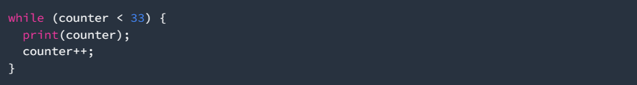

Langkah 2:
Silakan coba eksekusi (Run) kode pada langkah 1 tersebut. Apa yang terjadi? Jelaskan! Lalu perbaiki jika terjadi error.  
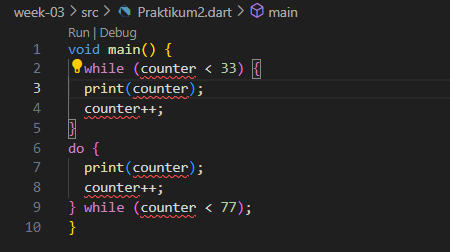

> Variabel counter Tidak Dideklarasikan dan Diinisialisasi, Variabel counter digunakan dalam perulangan, tetapi tidak dideklarasikan atau diinisialisasi sebelumnya
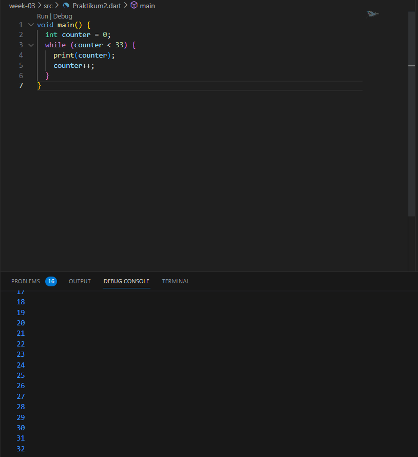

Langkah 3:
Tambahkan kode program berikut, lalu coba eksekusi (Run) kode Anda.

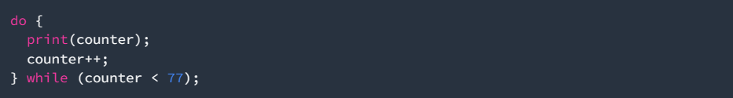
Apa yang terjadi ? Jika terjadi error, silakan perbaiki namun tetap menggunakan do-while.

>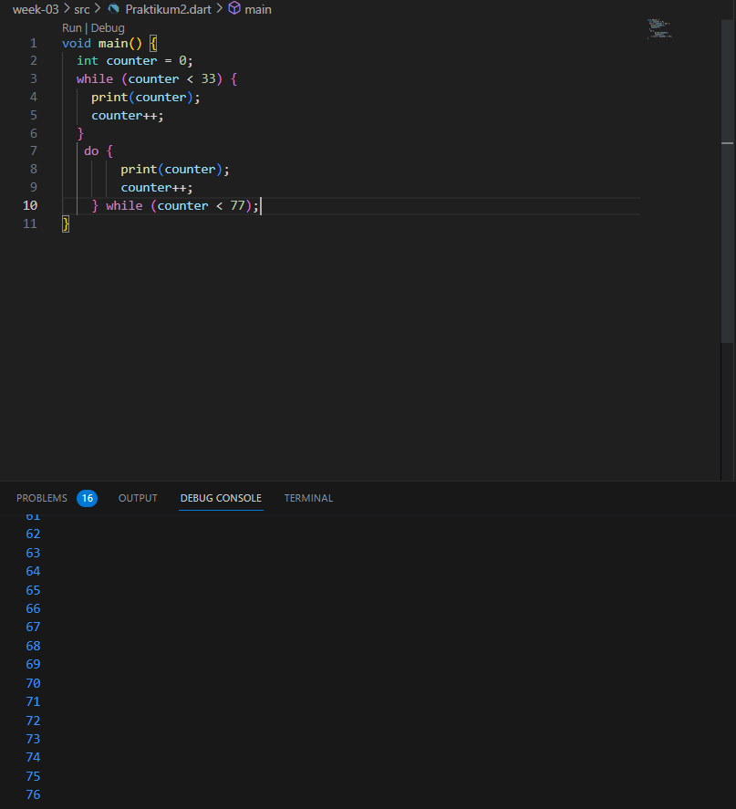
Variabel counter dideklarasikan sebagai int dan diinisialisasi dengan nilai 0 sebelum digunakan dalam perulangan do-while. Ini akan menghindari kesalahan yang muncul dalam kode awal

## Praktikum 3: Menerapkan Perulangan "for" dan "break-continue"

Selesaikan langkah-langkah praktikum berikut ini menggunakan DartPad di browser Anda.

Langkah 1:
Ketik atau salin kode program berikut ke dalam fungsi main().
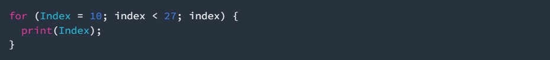

Langkah 2:
Silakan coba eksekusi (Run) kode pada langkah 1 tersebut. Apa yang terjadi? Jelaskan! Lalu perbaiki jika terjadi error.
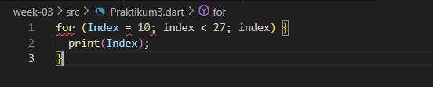

>Variabel index didalam loop harus menggunakan huruf kecil dan juga menambahkan index++ (atau index += 1 atau Index = index + 1) di dalam loop for untuk menginkremen nilai index, sehingga loop dapat berhenti setelah kondisi tertentu terpenuhi.
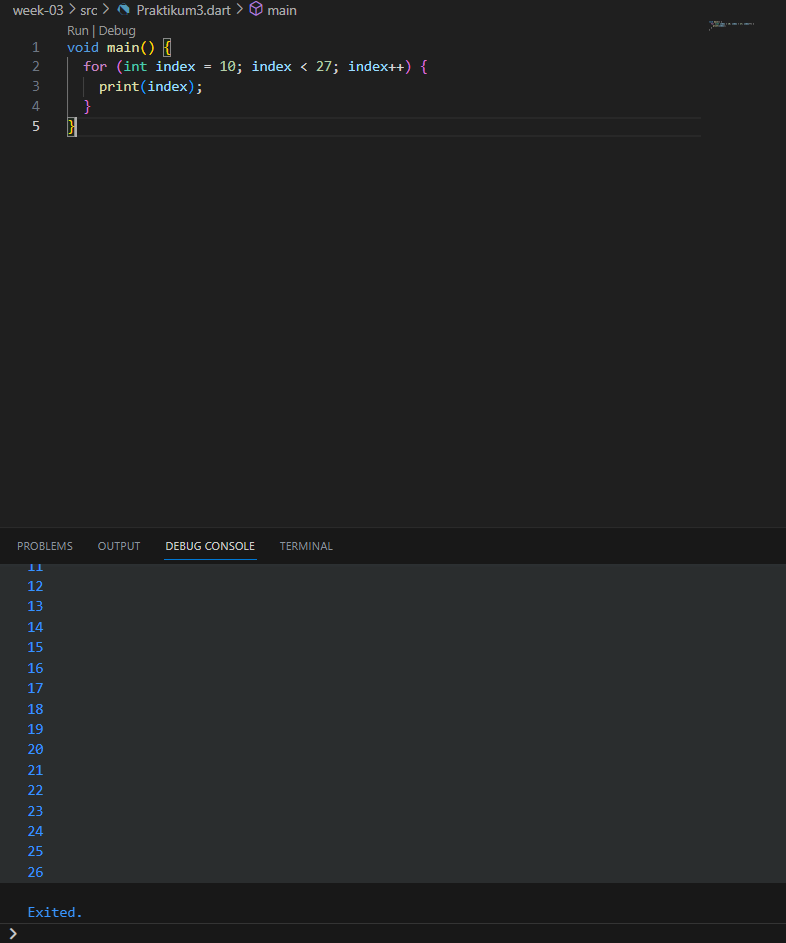

Langkah 3:
Tambahkan kode program berikut di dalam for-loop, lalu coba eksekusi (Run) kode Anda.
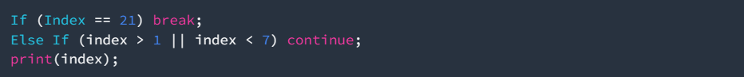

Apa yang terjadi ? Jika terjadi error, silakan perbaiki namun tetap menggunakan for dan break-continue.

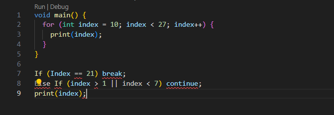

>Pada variabel index harus menggunakan huruf kecil, dan penggunaan If dan Else If harus diganti menjadi if dan else if dengan huruf kecil, penambahan kurung kurawal {} untuk mengelompokkan pernyataan di dalam blok if dan else if
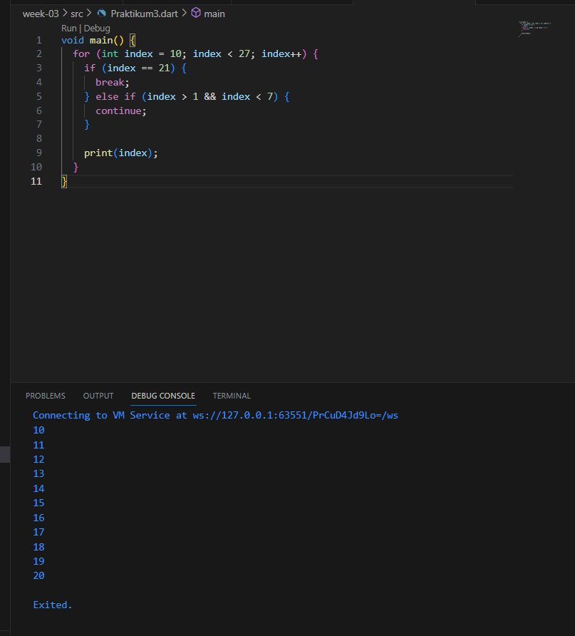

## TUGAS PRAKTIIKUM

1.Silakan selesaikan Praktikum 1 sampai 3, lalu dokumentasikan berupa screenshot hasil pekerjaan beserta penjelasannya!
>Sudah

2.Buatlah sebuah program yang dapat menampilkan bilangan prima dari angka 0 sampai 201 menggunakan Dart. Ketika bilangan prima ditemukan, maka tampilkan nama lengkap dan NIM Anda.
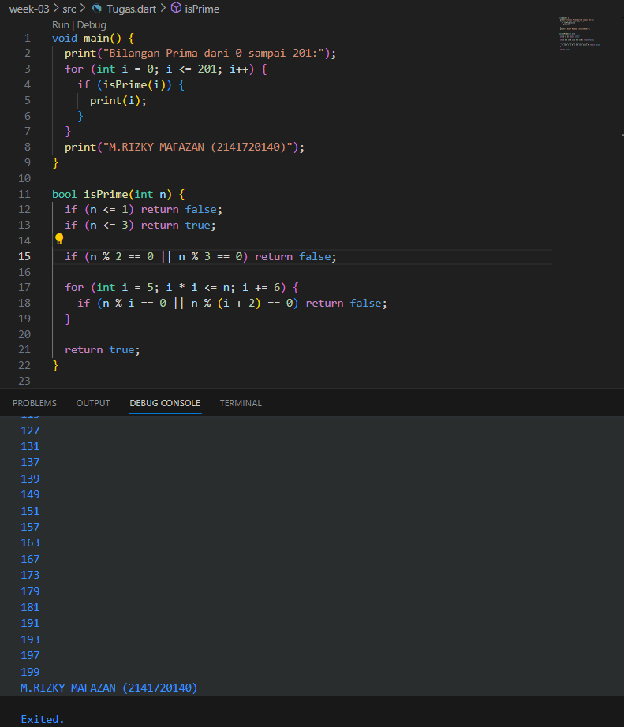

3.Kumpulkan berupa link commit repo GitHub pada tautan yang telah disediakan di grup Telegram!