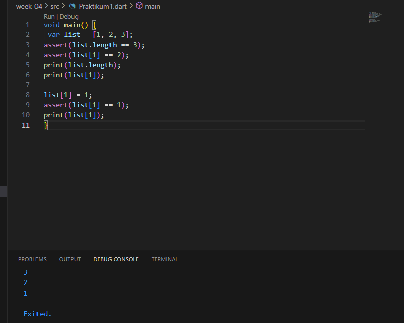
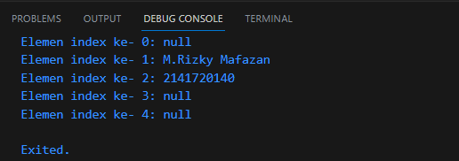
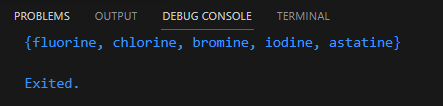
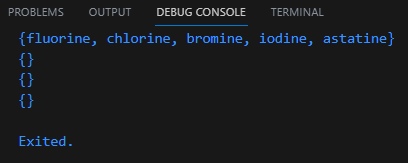
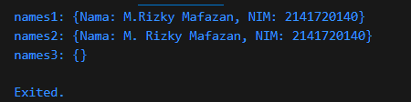
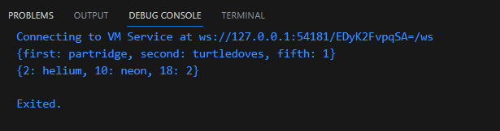
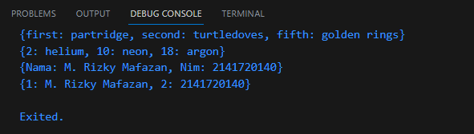
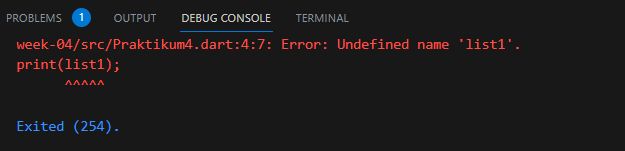

# 2141720140-mobile-2023
# M. Rizky Mafazan
# 3F
# 16
<br><br><br>

## Praktikum 1 : Eksperimen Tipe Data List
Langkah 1: Ketik atau salin kode program berikut ke dalam void main().
```dart
var list = [1, 2, 3];
assert(list.length == 3);
assert(list[1] == 2);
print(list.length);
print(list[1]);

list[1] = 1;
assert(list[1] == 1);
print(list[1]);
```
Langkah 2: Silakan coba eksekusi (Run) kode pada langkah 1 tersebut. Apa yang terjadi? Jelaskan!



Langkah 3: Ubah kode pada langkah 1 menjadi variabel final yang mempunyai index = 5 dengan default value = null. Isilah nama dan NIM Anda pada elemen index ke-1 dan ke-2. Lalu print dan capture hasilnya. Apa yang terjadi ? Jika terjadi error, silakan perbaiki.
```dart
void main() {
  final List<String?> list = List.filled(5, null);
  list[1] = 'M.Rizky Mafazan';
  list[2] = '2141720140';

  for (int i = 0; i < list.length; i++) {
    print('Elemen index ke- $i: ${list[i]}');
  }
}
```



<br><br>

## Praktikum 2: Eksperimen Tipe Data Set
Langkah 1:
Ketik atau salin kode program berikut ke dalam fungsi main().
```dart
var halogens = {'fluorine', 'chlorine', 'bromine', 'iodine', 'astatine'};
print(halogens);
```

Langkah 2:
Silakan coba eksekusi (Run) kode pada langkah 1 tersebut. Apa yang terjadi? Jelaskan! Lalu perbaiki jika terjadi error.



Langkah 3:
Tambahkan kode program berikut, lalu coba eksekusi (Run) kode Anda.
```dart
var names1 = <String>{};
Set<String> names2 = {}; // This works, too.
var names3 = {}; // Creates a map, not a set.

print(names1);
print(names2);
print(names3);
```

Apa yang terjadi ? Jika terjadi error, silakan perbaiki namun tetap menggunakan ketiga variabel tersebut. Tambahkan elemen nama dan NIM Anda pada kedua variabel Set tersebut dengan dua fungsi berbeda yaitu .add() dan .addAll(). Untuk variabel Map dihapus, nanti kita coba di praktikum selanjutnya.
Dokumentasikan code dan hasil di console, lalu buat laporannya.



```dart
void main() {
  var names1 = <String>{};
  Set<String> names2 = {};

names1.add('Nama: M.Rizky Mafazan');
  names1.add('NIM: 2141720140');
  names2.addAll(['Nama: M. Rizky Mafazan', 'NIM: 2141720140']);

  print('names1: $names1');
  print('names2: $names2');

  var names3 = {};
  print('names3: $names3');
}
```


<br><br>

## Praktikum 3: Eksperimen Tipe Data Maps
Langkah 1:
Ketik atau salin kode program berikut ke dalam fungsi main().
```dart
var gifts = {
  // Key:    Value
  'first': 'partridge',
  'second': 'turtledoves',
  'fifth': 1
};

var nobleGases = {
  2: 'helium',
  10: 'neon',
  18: 2,
};

print(gifts);
print(nobleGases);
```

Langkah 2:
Silakan coba eksekusi (Run) kode pada langkah 1 tersebut. Apa yang terjadi? Jelaskan! Lalu perbaiki jika terjadi error.


> Penggunaan Map dalam Dart, yang digunakan untuk mengaitkan kunci (keys) dengan nilai-nilai (values)

Langkah 3:
Tambahkan kode program berikut, lalu coba eksekusi (Run) kode Anda.
```dart
var mhs1 = Map<String, String>();
gifts['first'] = 'partridge';
gifts['second'] = 'turtledoves';
gifts['fifth'] = 'golden rings';

var mhs2 = Map<int, String>();
nobleGases[2] = 'helium';
nobleGases[10] = 'neon';
nobleGases[18] = 'argon';
```
Apa yang terjadi ? Jika terjadi error, silakan perbaiki.

Tambahkan elemen nama dan NIM Anda pada tiap variabel di atas (gifts, nobleGases, mhs1, dan mhs2). Dokumentasikan hasilnya dan buat laporannya!

```dart
void main() {
  var gifts = {
    // Key:    Value
    'first': 'partridge',
    'second': 'turtledoves',
    'fifth': 1,
  };

  var nobleGases = {
    2: 'helium',
    10: 'neon',
    18: 2,
  };

  var mhs1 = Map<String, String>();
  gifts['first'] = 'partridge';
  gifts['second'] = 'turtledoves';
  gifts['fifth'] = 'golden rings';

  var mhs2 = Map<int, String>();

  nobleGases[2] = 'helium';
  nobleGases[10] = 'neon';
  nobleGases[18] = 'argon';

  mhs1['Nama'] = 'M. Rizky Mafazan';
  mhs1['Nim'] = '2141720140';

  mhs2[1] = 'M. Rizky Mafazan';
  mhs2[2] = '2141720140';

  print(gifts);
  print(nobleGases);
  print(mhs1);
  print(mhs2);
}
```


<br><br>
## Praktikum 4: Eksperimen Tipe Data List: Spread dan Control-flow Operators
Langkah 1:
Ketik atau salin kode program berikut ke dalam fungsi main().
```dart
var list = [1, 2, 3];
var list2 = [0, ...list];
print(list1);
print(list2);
print(list2.length);
```

Langkah 2:
Silakan coba eksekusi (Run) kode pada langkah 1 tersebut. Apa yang terjadi? Jelaskan! Lalu perbaiki jika terjadi error.



Langkah 3:
Tambahkan kode program berikut, lalu coba eksekusi (Run) kode Anda.
```dart
list1 = [1, 2, null];
print(list1);
var list3 = [0, ...?list1];
print(list3.length);
```
Apa yang terjadi ? Jika terjadi error, silakan perbaiki.


Tambahkan variabel list berisi NIM Anda menggunakan Spread Operators. Dokumentasikan hasilnya dan buat laporannya! 


Langkah 4:
Tambahkan kode program berikut, lalu coba eksekusi (Run) kode Anda.
```dart
var nav = ['Home', 'Furniture', 'Plants', if (promoActive) 'Outlet'];
print(nav);
```
Apa yang terjadi ? Jika terjadi error, silakan perbaiki. Tunjukkan hasilnya jika variabel promoActive ketika true dan false.


Langkah 5:
Tambahkan kode program berikut, lalu coba eksekusi (Run) kode Anda.
```dart
var nav2 = ['Home', 'Furniture', 'Plants', if (login case 'Manager') 'Inventory'];
print(nav2);
```
Apa yang terjadi ? Jika terjadi error, silakan perbaiki. Tunjukkan hasilnya jika variabel login mempunyai kondisi lain.


Langkah 6:
Tambahkan kode program berikut, lalu coba eksekusi (Run) kode Anda.

```dart
var listOfInts = [1, 2, 3];
var listOfStrings = ['#0', for (var i in listOfInts) '#$i'];
assert(listOfStrings[1] == '#1');
print(listOfStrings);
```
Apa yang terjadi ? Jika terjadi error, silakan perbaiki. Jelaskan manfaat Collection For dan dokumentasikan hasilnya.


<br><br>
## Praktikum 5: Eksperimen Tipe Data Records

Selesaikan langkah-langkah praktikum berikut ini menggunakan VS Code atau Code Editor favorit Anda.

Langkah 1:
Ketik atau salin kode program berikut ke dalam fungsi main().

```dart
var record = ('first', a: 2, b: true, 'last');
print(record)
```

Langkah 2:
Silakan coba eksekusi (Run) kode pada langkah 1 tersebut. Apa yang terjadi? Jelaskan! Lalu perbaiki jika terjadi error.


> Menginisialisasi sebuah map dengan beberapa pasangan key-value dan kemudian mencetak isi map tersebut menggunakan fungsi print.

Langkah 3:
Tambahkan kode program berikut di luar scope void main(), lalu coba eksekusi (Run) kode Anda.

```dart
(int, int) tukar((int, int) record) {
  var (a, b) = record;
  return (b, a);
}
```
Apa yang terjadi ? Jika terjadi error, silakan perbaiki. Gunakan fungsi tukar() di dalam main() sehingga tampak jelas proses pertukaran value field di dalam Records.


Langkah 4:
Tambahkan kode program berikut di dalam scope void main(), lalu coba eksekusi (Run) kode Anda.

```dart
// Record type annotation in a variable declaration:
(String, int) mahasiswa;
print(mahasiswa);
```
Apa yang terjadi ? Jika terjadi error, silakan perbaiki. Inisialisasi field nama dan NIM Anda pada variabel record mahasiswa di atas. Dokumentasikan hasilnya dan buat laporannya!


```dart
void main() {
  (String, int) mahasiswa = ('M. Rizky Mafazan', 2141720140);
  print(mahasiswa);
}
```


Langkah 5:
Tambahkan kode program berikut di dalam scope void main(), lalu coba eksekusi (Run) kode Anda.
```dart
var mahasiswa2 = ('first', a: 2, b: true, 'last');

print(mahasiswa2.$1); // Prints 'first'
print(mahasiswa2.a); // Prints 2
print(mahasiswa2.b); // Prints true
print(mahasiswa2.$2); // Prints 'last'
```
Apa yang terjadi ? Jika terjadi error, silakan perbaiki. Gantilah salah satu isi record dengan nama dan NIM Anda, lalu dokumentasikan hasilnya dan buat laporannya!
```dart
void main() {
  (String, int) mahasiswa = ('M. Rizky Mafazan', 2141720140);
  print(mahasiswa);

var mahasiswa2 = ('M.Rizky Mafazan', a: 2, b: true, '2141720140');

print(mahasiswa2.$1); // Prints 'first'
print(mahasiswa2.a); // Prints 2
print(mahasiswa2.b); // Prints true
print(mahasiswa2.$2); // Prints 'last'
}
```


<br><br>

## Tugas Praktikum
1. Silakan selesaikan Praktikum 1 sampai 5, lalu dokumentasikan berupa screenshot hasil pekerjaan Anda beserta penjelasannya!

2. Jelaskan yang dimaksud Functions dalam bahasa Dart!
> Dalam bahasa pemrograman Dart, "functions" (fungsi) adalah blok kode yang dapat digunakan untuk menjalankan tugas tertentu

3. Jelaskan jenis-jenis parameter di Functions beserta contoh sintaksnya!
> Positional Parameters 

Yaitu jenis parameter yang biasanya digunakan dan diidentifikasi berdasarkan posisinya dalam daftar parameter.

```dart
void printSum(int a, int b) {
  print(a + b);
}

void main() {
  printSum(5, 3); // Memanggil fungsi dengan parameter posisi
}

```
> Named Parameters (Parameter Bernama)

Yaitu memberi label atau nama parameter saat memanggil fungsi.
```dart
void printDetails({String name, int age}) {
  print("Nama: $name, Umur: $age");
}

void main() {
  printDetails(name: "Alice", age: 30); // Memanggil fungsi dengan parameter bernama
}

```
> Default Parameters (Parameter Default):

Yaitu memberikan nilai default untuk parameter, yang akan digunakan jika tidak ada nilai yang diberikan saat memanggil fungsi.

```dart
void greet(String name, {String greeting = "Halo"}) {
  print("$greeting, $name!");
}

void main() {
  greet("Bob"); // Menggunakan nilai default untuk 'greeting'
  greet("Alice", greeting: "Selamat pagi"); // Memberikan nilai parameter 'greeting'
}

```

> Required Parameters (Parameter Wajib):

Yaitu menandai parameter sebagai wajib dengan tanda tanya (?) pada deklarasinya. Ini memastikan bahwa nilai harus diberikan saat memanggil fungsi.

```dart
void printMessage(String message) {
  print(message);
}

void main() {
  printMessage("Hello, world!"); // OK, memberikan nilai wajib
  // printMessage(); // Error, nilai wajib tidak diberikan
}
```

> Rest Parameters (Parameter Rest atau Variadic):

Yaitu menggunakan operator ... untuk mengambil sejumlah parameter yang tidak terbatas sebagai daftar atau array.

```dart
void printNumbers(String header, int first, int second, [int? third, int? fourth]) {
  print("$header: $first, $second, $third, $fourth");
}

void main() {
  printNumbers("Angka", 1, 2);
  printNumbers("Angka lagi", 1, 2, 3);
  printNumbers("Angka lagi lagi", 1, 2, 3, 4);
}

```

4. Jelaskan maksud Functions sebagai first-class objects beserta contoh sintaknya!
> Yaitu fungsi dianggap sebagai objek yang dapat diperlakukan seperti objek lainnya, seperti variabel, string, atau bilangan.
```dart
int Function(int, int) add = (int a, int b) {
  return a + b;
};

int result = add(3, 5); 

5. Apa itu Anonymous Functions? Jelaskan dan berikan contohnya!
>  Anonymous functions adalah fungsi sederhana yang dapat digunakan secara langsung atau disimpan dalam variabel. Anonymous functions berguna dalam situasi-situasi di mana Anda memerlukan fungsi kecil yang tidak memerlukan deklarasi yang lengkap.

```dart
var add = (int a, int b) => a + b; 
int result = add(3, 5); 
List<int> numbers = [1, 2, 3, 4, 5];
numbers.forEach((number) {
  print(number * 2); 
});
```
6. Jelaskan perbedaan Lexical scope dan Lexical closures! Berikan contohnya!
> Lexical Scope 

Variabel yang dideklarasikan di dalam suatu fungsi atau blok kode hanya dapat diakses di dalam fungsi atau blok tersebut atau dalam fungsi-fungsi yang bersarang di dalamnya.
```dart
void main() {
  var x = 10;
  
  void printX() {
    print(x); // Variabel x hanya dapat diakses di dalam main
  }
  
  printX();
}

```

> Lexical closures

Suatu fungsi untuk mengingat dan mengakses variabel-variabel yang ada dalam lexical scope tempat fungsi tersebut didefinisikan, bahkan setelah fungsi tersebut keluar dari lexical scope tersebut.
```dart
Function outer() {
  var x = 10;
  
  void inner() {
    print(x);
  }
  
  return inner; // Mengembalikan fungsi inner sebagai closure
}

void main() {
  var closureFunc = outer();
  closureFunc(); // Meskipun outer sudah selesai dieksekusi, inner masih dapat mengakses variabel x yang ada dalam lexical scope outer
}

```
7. Jelaskan dengan contoh cara membuat return multiple value di Functions!

> Untuk me-return sebuah nilai ganda (multiple value), kita dapat memanfaatkan beberapa cara
```dart
class MultipleValues {
  final int value1;
  final String value2;

  MultipleValues(this.value1, this.value2);
}

MultipleValues returnMultipleValues() {
  int intValue = 42;
  String stringValue = "Hello, Dart!";
  
  return MultipleValues(intValue, stringValue);
}

void main() {
  var result = returnMultipleValues();
  print("Value 1: ${result.value1}");
  print("Value 2: ${result.value2}");
}

```

Kumpulkan berupa link commit repo GitHub pada tautan yang telah disediakan di grup Telegram!