## Nama : M . Rizky Mafazan
## NIM : 2141720140
## Kelas : 3F
#
#

# Week 7 - Layout

## Praktikum 1: Membangun Layout di Flutter

---

## Praktikum 2: Implementasi button row

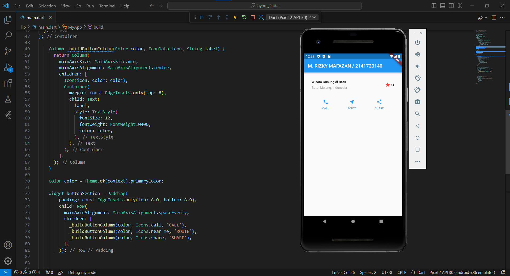

---

## Praktikum 3: Implementasi text section

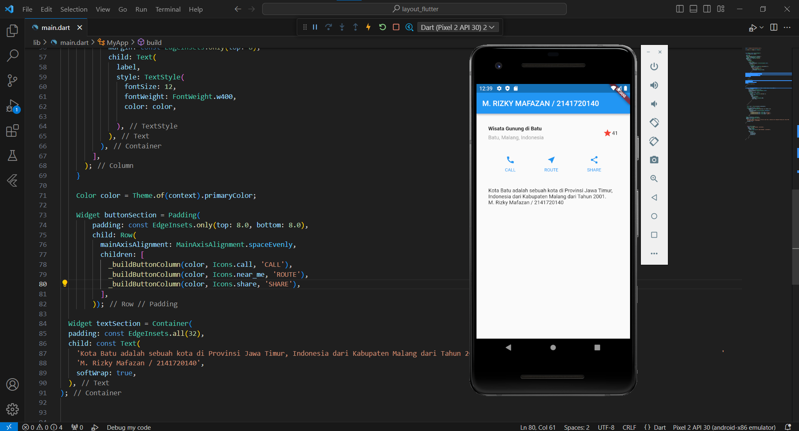

---

## Praktikum 4: Implementasi image section

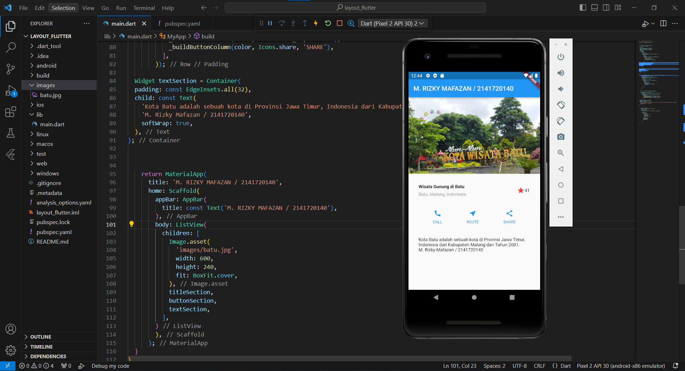

---

##
##
# Tugas Praktikum (Basic Layout)

## Row and Column

| Row                                          | Column                                             |
|----------------------------------------------|:--------------------------------------------------:|
| 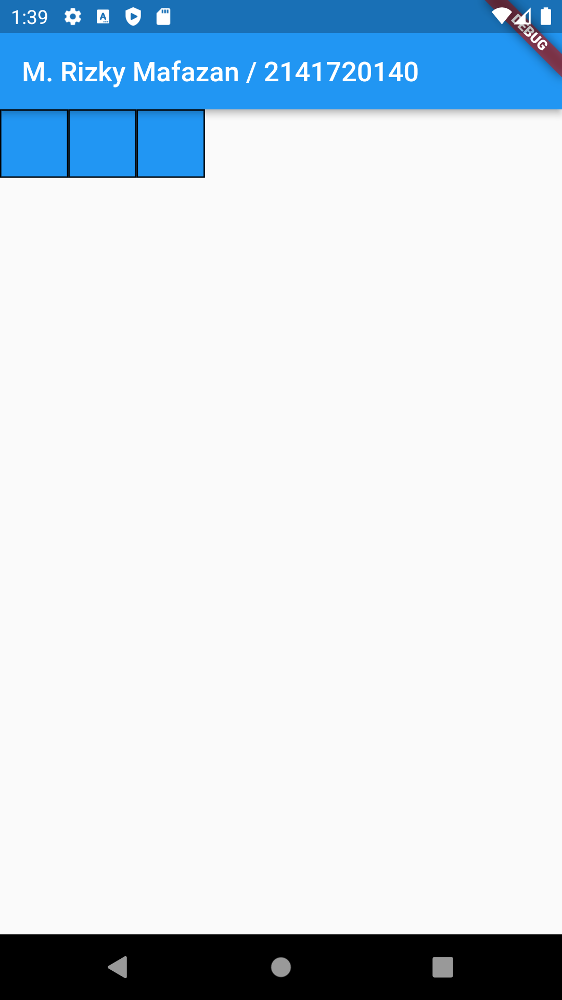                        | 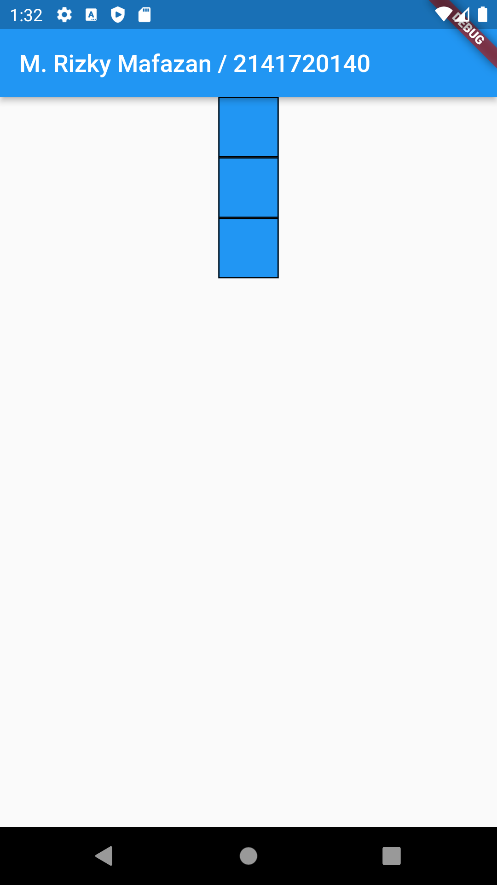                        |

## Axis size and alignment
                         | 

|                 MainAxisAlignment.start      | MainAxisAlignment.end                              |
|----------------------------------------------|:--------------------------------------------------:|
|     | 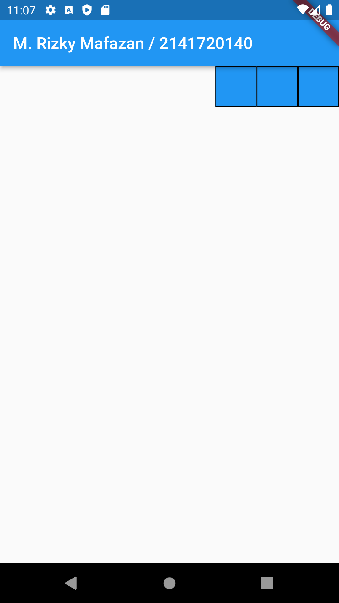          |

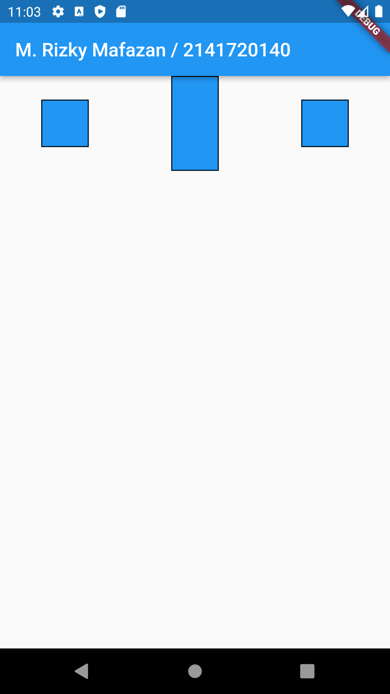

## Flexible widget

| FlexFit.loose                                | FlexFit.tight                                      |
|----------------------------------------------|:--------------------------------------------------:|
| 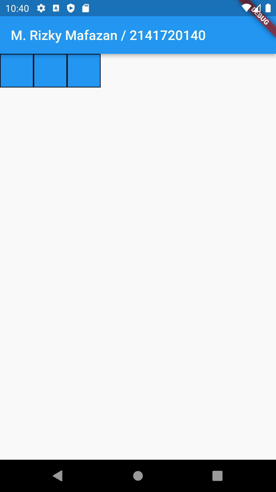    | 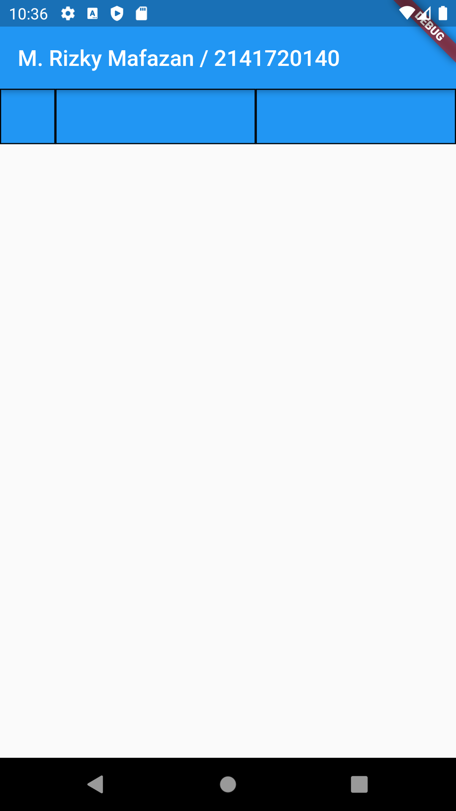          |

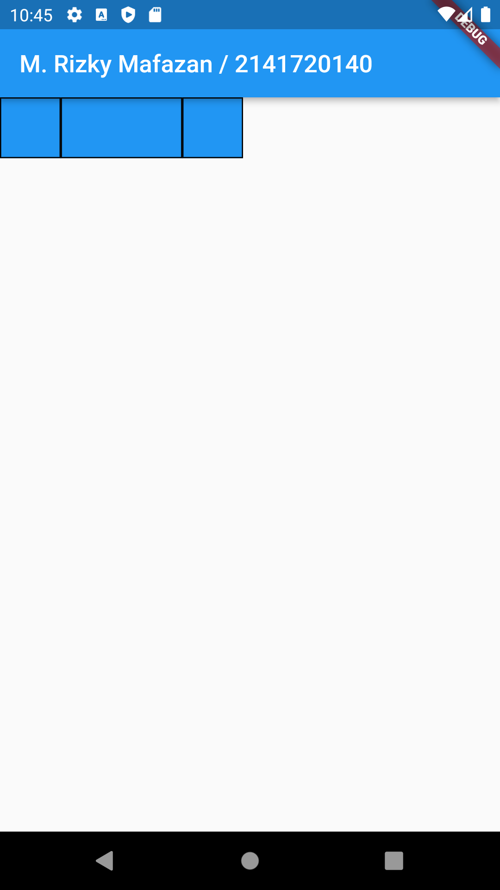

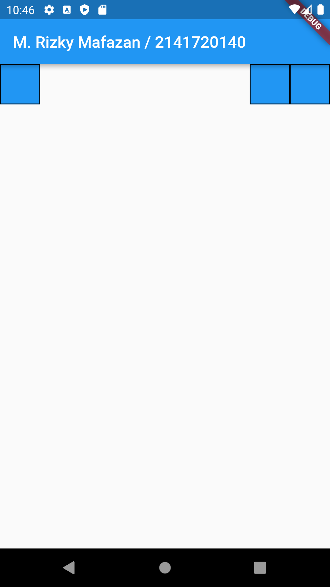 

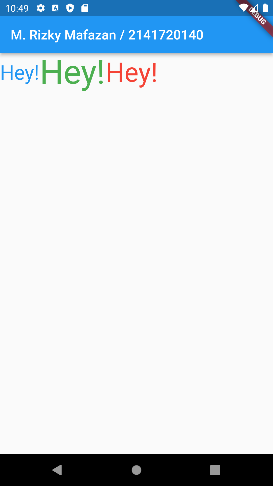 

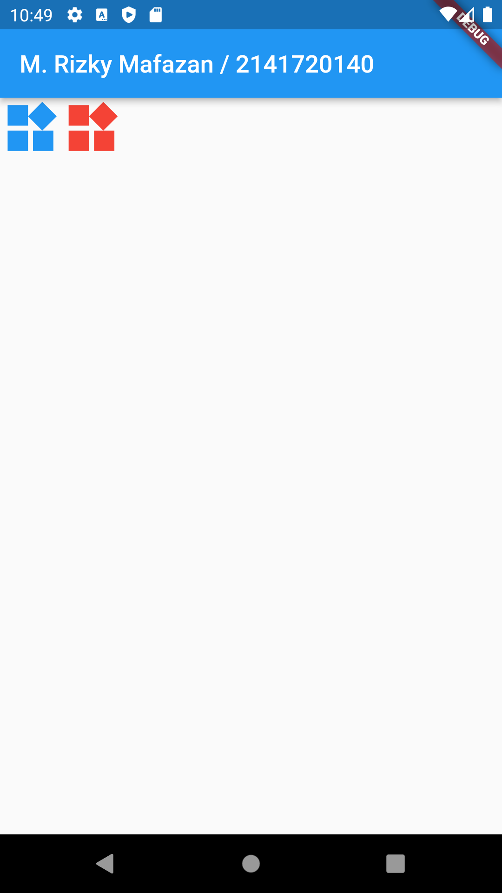 

 

 

 