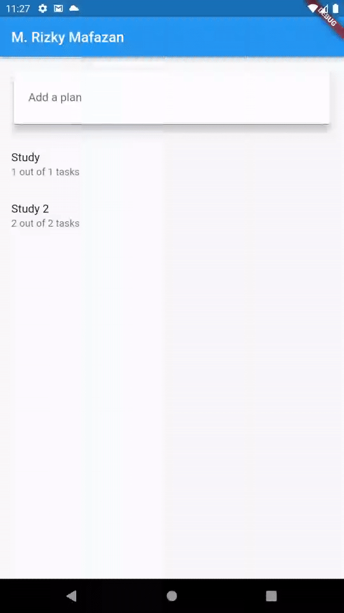
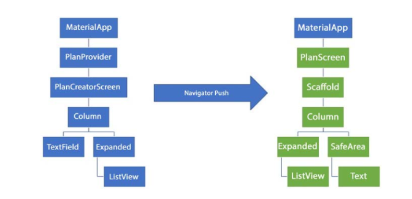

## Nama : M . Rizky Mafazan (16)
## NIM : 2141720140
## Kelas : 3F

 
 

# Week 11 - Dasar State Management

### Praktikum 1: Dasar State dengan Model-View

# Tugas Praktikum 1: Dasar State dengan Model-View

1. Selesaikan langkah-langkah praktikum tersebut, lalu dokumentasikan berupa GIF hasil akhir praktikum beserta penjelasannya di file README.md!
> Selesai

2. Jelaskan maksud dari langkah 4 pada praktikum tersebut! Mengapa dilakukan demikian?
> Mengekspor kelas Plan dan Task. Eksport adalah cara untuk membuat kelas atau fungsi tersedia untuk modul lain.

3. Mengapa perlu variabel plan di langkah 6 pada praktikum tersebut? Mengapa dibuat konstanta ?
> Variabel plan diperlukan untuk menyimpan data rencana yang akan ditampilkan di layar PlanScreen. Data rencana tersebut dapat berupa nama rencana, daftar tugas, dan status penyelesaian tugas.

>Variabel plan dibuat konstanta karena data rencana tidak akan diubah pada layar PlanScreen. Layar PlanScreen hanya digunakan untuk menampilkan data rencana, bukan untuk mengeditnya. Dengan membuat variabel plan konstanta, dapat dipastikan bahwa data rencana tidak akan diubah secara tidak sengaja.

4. Lakukan capture hasil dari Langkah 9 berupa GIF, kemudian jelaskan apa yang telah Anda buat!
> Membuat ListTile yang menampilkan task dan memungkinkan pengguna untuk mengedit task tersebut.

5. Apa kegunaan method pada Langkah 11 dan 13 dalam lifecyle state ?
> Method initState() dan dispose() adalah bagian dari lifecycle state widget di Flutter. Lifecycle state adalah status widget yang berubah seiring dengan waktu. Method initState() digunakan untuk menginisialisasi widget, sedangkan method dispose() digunakan untuk membersihkan widget saat widget dimusnahkan.

6. Kumpulkan laporan praktikum Anda berupa link commit atau repository GitHub ke spreadsheet yang telah disediakan!
> SELESAI

### Praktikum 2: Mengelola Data Layer dengan InheritedWidget dan InheritedNotifier

# Tugas Praktikum 2: InheritedWidget

1. Selesaikan langkah-langkah praktikum tersebut, lalu dokumentasikan berupa GIF hasil akhir praktikum beserta penjelasannya di file README.md!
> SELESAI

2. Jelaskan mana yang dimaksud InheritedWidget pada langkah 1 tersebut! Mengapa yang digunakan InheritedNotifier?
> InheritedWidget pada langkah 1 yaitu return context dependOnInheritedWidgetOfExactType()!.notifier!; InheritedNotifier digunakan karena ia menyediakan kemampuan untuk mempublikasikan notifikasi saat terjadi perubahan pada data yang dipantau. Dalam konteks ini, PlanProvider menggunakan ValueNotifier untuk mengatur perubahan pada data Plan. Dengan demikian, saat terjadi perubahan pada data Plan, PlanProvider akan memberi tahu widget-widget di bawahnya yang menggunakan data tersebut untuk melakukan rebuild

3. Jelaskan maksud dari method di langkah 3 pada praktikum tersebut! Mengapa dilakukan demikian?
> Membuat pesan penyelesaian task yang lebih informatif. Pesan tersebut tidak hanya menunjukkan jumlah task yang selesai, tetapi juga jumlah total task. Hal ini berguna untuk pengguna untuk mengetahui persentase penyelesaian task.

4. Lakukan capture hasil dari Langkah 9 berupa GIF, kemudian jelaskan apa yang telah Anda buat!
> SafeArea Menempatkan teks plan.completenessMessage di bagian bawah layar, di luar daftar tugas. Ini memastikan bahwa teks tersebut tidak tertutup oleh elemen UI lainnya, seperti tombol navigasi sistem atau area status di perangkat.

### Praktikum 3: Membuat State di Multiple Screens

# Tugas Praktikum 3: State di Multiple Screens

1. Selesaikan langkah-langkah praktikum tersebut, lalu dokumentasikan berupa GIF hasil akhir praktikum beserta penjelasannya di file README.md! Jika Anda menemukan ada yang error atau tidak berjalan dengan baik, silakan diperbaiki sesuai dengan tujuan aplikasi tersebut dibuat.
> SELESAI

2. Berdasarkan Praktikum 3 yang telah Anda lakukan, jelaskan maksud dari gambar diagram berikut ini!

> 
Diagram tersebut menunjukkan proses kerja aplikasi material.
Diagram dimulai dengan MaterialApp, yang merupakan kelas dasar untuk semua aplikasi material. MaterialApp bertanggung jawab untuk menginisialisasi aplikasi dan menyediakan fitur-fitur dasar, seperti tema, bahasa, dan orientasi layar. Selanjutnya, diagram menunjukkan penggunaan PlanProvider, yang merupakan kelas yang menyediakan data untuk rencana. PlanCreatorScreen adalah layar yang digunakan untuk membuat rencana. Layar ini menggunakan TextField untuk mengumpulkan input dari pengguna dan ListView untuk menampilkan daftar rencana. Setelah pengguna membuat rencana, Navigator Push digunakan untuk berpindah ke PlanScreen.

3. Lakukan capture hasil dari Langkah 14 berupa GIF, kemudian jelaskan apa yang telah Anda buat!
> Hasil ada diatas, Membuat widget yang menampilkan daftar rencana. Widget ini terdiri dari dua bagian utama yaitu Conditional statement dan ListView builder

4. Kumpulkan laporan praktikum Anda berupa link commit atau repository GitHub ke spreadsheet yang telah disediakan!
> SELESAI