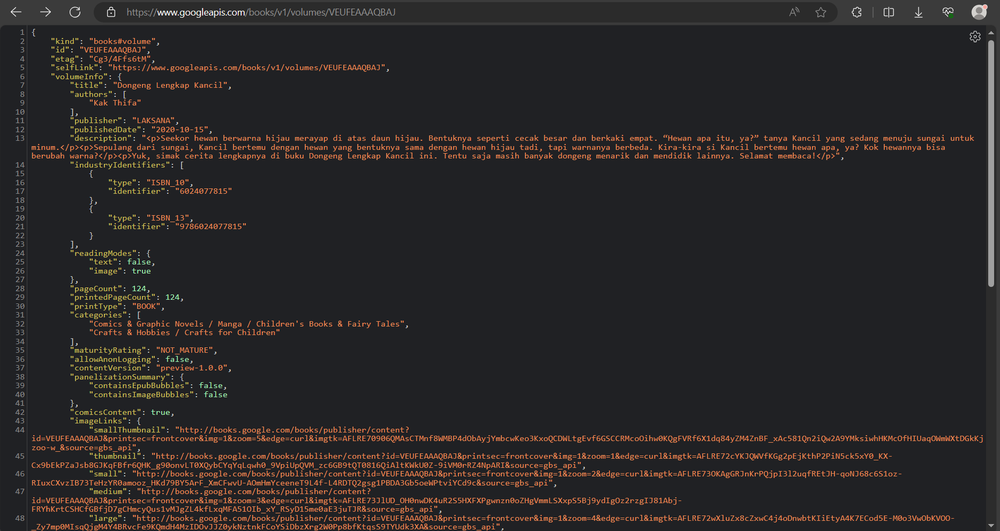
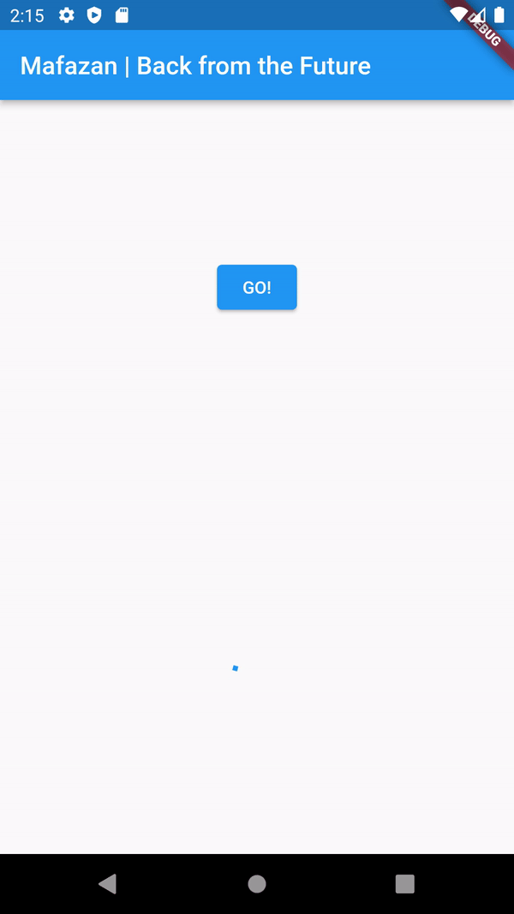
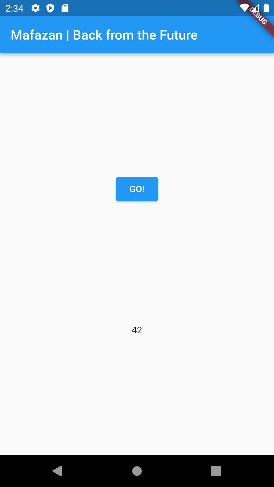

## Nama : M . Rizky Mafazan (16)
## NIM : 2141720140
## Kelas : 3F

<br>
<br>

# Week 12 - Pemrograman Asynchronous

### Praktikum 1: Mengunduh Data dari Web Service (API)


**Soal 1**

Tambahkan nama panggilan Anda pada title app sebagai identitas hasil pekerjaan Anda.

```dart
import 'dart:async';
import 'package:flutter/material.dart';
import 'package:http/http.dart';
import 'package:http/http.dart' as http;

void main() {
  runApp(const MyApp());
}

class MyApp extends StatelessWidget {
  const MyApp({super.key});

  @override
  Widget build(BuildContext context) {
    return MaterialApp(
      title: 'Mafazan Future Demo',
      theme: ThemeData(
        primarySwatch: Colors.blue,
        visualDensity: VisualDensity.adaptivePlatformDensity,
      ),
      home: const FuturePage(),
    );
  }
}

class FuturePage extends StatefulWidget {
  const FuturePage({super.key});

  @override
  State<FuturePage> createState() => _FuturePageState();
}

class _FuturePageState extends State<FuturePage> {
  String result = '';
  @override
  Widget build(BuildContext context) {
    return Scaffold(
      appBar: AppBar(
        title: const Text('Back from the Future'),
      ),
      body: Center(
        child: Column(children: [
          const Spacer(),
          ElevatedButton(
            child: const Text('GO!'),
            onPressed: () {},
          ),
          const Spacer(),
          Text(result),
          const Spacer(),
          const CircularProgressIndicator(),
          const Spacer(),
        ]),
      ),
    );
  }
}

Future<Response> getData() async {
  const authority = 'www.googleapis.com';
  const path = '/books/v1/volumes/VEUFEAAAQBAJ';
  Uri url = Uri.https(authority, path);
  return http.get(url);
}
```


**Soal 2**





**Soal 3**
- Jelaskan maksud kode langkah 5 tersebut terkait substring dan catchError!
> substring() digunakan untuk mengambil substring dari sebuah string, dimulai dari indeks awal dan berakhir pada indeks akhir yang diberikan, sedangkan catchError() digunakan untuk menangani kesalahan yang terjadi dalam operasi asinkron.

- Capture hasil praktikum Anda berupa GIF dan lampirkan di README. Lalu lakukan commit dengan pesan "W12: Soal 3".


### Praktikum 2: Menggunakan await/async untuk menghindari callbacks



**Soal 4**
- Jelaskan maksud kode langkah 1 dan 2 tersebut!
> Pada langkah 1, dilakukan penambahan tiga method baru dalam kelas _FuturePageState. Metode-metode ini, yaitu returnOneAsync, returnTwoAsync, dan returnThreeAsync, sebenarnya melakukan operasi asinkron yang mensimulasikan penundaan selama 3 detik dan mengembalikan nilai 1, 2, dan 3 secara berturut-turut.

> Pada langkah 2, dilakukan penambahan method count. Method ini memiliki tiga pemanggilan fungsi asinkron (await) ke metode-metode yang telah ditambahkan sebelumnya. Method count menghitung jumlah total dari hasil yang dikembalikan oleh metode-metode asinkron dan kemudian mengatur nilai result dalam state untuk menampilkan hasilnya.

### Praktikum 3: Menggunakan Completer di Future

**Soal 5**



- Jelaskan maksud kode langkah 2 tersebut!
> Kode ini mendefinisikan sebuah kelas bernama Completer dengan variabel bernama completer. Kelas Completer digunakan untuk membuat objek Future yang dapat diselesaikan nanti. Kode ini juga mendefinisikan sebuah metode bernama getNumber() yang mengembalikan objek Future. Metode ini pertama-tama membuat objek completer baru, kemudian memanggil metode calculate(), dan terakhir mengembalikan objek completer.future. Metode calculate() menggunakan await Future.delayed(const Duration(seconds: 5)) untuk menunda eksekusi selama 5 detik. Setelah 5 detik, metode ini melengkapi objek completer dengan nilai 42.
