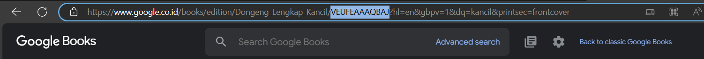

## Nama : M . Rizky Mafazan (16)
## NIM : 2141720140
## Kelas : 3F

<br>
<br>

# Week 12 - Pemrograman Asynchronous

### Praktikum 1: Mengunduh Data dari Web Service (API)


**Soal 1**

Tambahkan nama panggilan Anda pada title app sebagai identitas hasil pekerjaan Anda.

```dart
import 'dart:async';
import 'package:flutter/material.dart';
import 'package:http/http.dart';
import 'package:http/http.dart' as http;

void main() {
  runApp(const MyApp());
}

class MyApp extends StatelessWidget {
  const MyApp({super.key});

  @override
  Widget build(BuildContext context) {
    return MaterialApp(
      title: 'Mafazan Future Demo',
      theme: ThemeData(
        primarySwatch: Colors.blue,
        visualDensity: VisualDensity.adaptivePlatformDensity,
      ),
      home: const FuturePage(),
    );
  }
}

class FuturePage extends StatefulWidget {
  const FuturePage({super.key});

  @override
  State<FuturePage> createState() => _FuturePageState();
}

class _FuturePageState extends State<FuturePage> {
  String result = '';
  @override
  Widget build(BuildContext context) {
    return Scaffold(
      appBar: AppBar(
        title: const Text('Back from the Future'),
      ),
      body: Center(
        child: Column(children: [
          const Spacer(),
          ElevatedButton(
            child: const Text('GO!'),
            onPressed: () {},
          ),
          const Spacer(),
          Text(result),
          const Spacer(),
          const CircularProgressIndicator(),
          const Spacer(),
        ]),
      ),
    );
  }
}

Future<Response> getData() async {
  const authority = 'www.googleapis.com';
  const path = '/books/v1/volumes/VEUFEAAAQBAJ';
  Uri url = Uri.https(authority, path);
  return http.get(url);
}
```


**Soal 2**




**Soal 3**
- Jelaskan maksud kode langkah 5 tersebut terkait substring dan catchError!
> substring() digunakan untuk mengambil substring dari sebuah string, dimulai dari indeks awal dan berakhir pada indeks akhir yang diberikan, sedangkan catchError() digunakan untuk menangani kesalahan yang terjadi dalam operasi asinkron.

- Capture hasil praktikum Anda berupa GIF dan lampirkan di README. Lalu lakukan commit dengan pesan "W12: Soal 3".


### Praktikum 2: Menggunakan await/async untuk menghindari callbacks


**Soal 4**
- Jelaskan maksud kode langkah 1 dan 2 tersebut!
> Pada langkah 1, dilakukan penambahan tiga method baru dalam kelas _FuturePageState. Metode-metode ini, yaitu returnOneAsync, returnTwoAsync, dan returnThreeAsync, sebenarnya melakukan operasi asinkron yang mensimulasikan penundaan selama 3 detik dan mengembalikan nilai 1, 2, dan 3 secara berturut-turut.

> Pada langkah 2, dilakukan penambahan method count. Method ini memiliki tiga pemanggilan fungsi asinkron (await) ke metode-metode yang telah ditambahkan sebelumnya. Method count menghitung jumlah total dari hasil yang dikembalikan oleh metode-metode asinkron dan kemudian mengatur nilai result dalam state untuk menampilkan hasilnya.

### Praktikum 3: Menggunakan Completer di Future

**Soal 5**


- Jelaskan maksud kode langkah 2 tersebut!
> Kode ini mendefinisikan sebuah kelas bernama Completer dengan variabel bernama completer. Kelas Completer digunakan untuk membuat objek Future yang dapat diselesaikan nanti. Kode ini juga mendefinisikan sebuah metode bernama getNumber() yang mengembalikan objek Future. Metode ini pertama-tama membuat objek completer baru, kemudian memanggil metode calculate(), dan terakhir mengembalikan objek completer.future. Metode calculate() menggunakan await Future.delayed(const Duration(seconds: 5)) untuk menunda eksekusi selama 5 detik. Setelah 5 detik, metode ini melengkapi objek completer dengan nilai 42.

**Soal 6**


- Jelaskan maksud perbedaan kode langkah 2 dengan langkah 5-6 tersebut!
> Pada langkah 5 mengubah metode calculate dengan menambahkan blok try-catch. Jika terjadi kesalahan selama operasi asinkron (misalnya, penundaan gagal), blok catch akan menangkap kesalahan tersebut, dan completer akan diselesaikan dengan sebuah objek kosong {}. Sedangkan Langkah 6 yaitu bagian dari fungsi onPressed pada tombol "GO!" yang memanggil metode getNumber. Pada langkah ini, setelah pemanggilan getNumber, then digunakan untuk menangkap hasilnya. Dalam blok then, nilai hasil dikonversi menjadi string dan diperbarui ke dalam variabel result melalui setState. Jika ada kesalahan, catchError akan menangkapnya dan mengatur result ke string "An error Occurred".


### Praktikum 4: Memanggil Future secara paralel

**Soal 7**


**Soal 8**

- Jelaskan maksud perbedaan kode langkah 1 dan 4!
> FutureGroup lebih fleksibel daripada Future.wait(). FutureGroup dapat digunakan untuk melakukan hal-hal seperti Membatalkan eksekusi future,Menangani kesalahan yang terjadi di future dan Mendapatkan hasil future dalam urutan apa pun. Sedangkan Future.wait() lebih mudah digunakan dan cukup untuk banyak kasus penggunaan.

### Praktikum 5: Menangani Respon Error pada Async Code

**Soal 9**


**Soal 10**

- Panggil method handleError() tersebut di ElevatedButton, lalu run. Apa hasilnya? Jelaskan perbedaan kode langkah 1 dan 4!
> Pada langkah 1, method returnError() tidak menangani error yang terjadi. Jika error terjadi, maka method tersebut akan berhenti dan tidak mengembalikan nilai apa pun. Sedangkan pada langkah 4, method handleError() menangani error yang terjadi dengan menggunakan try-catch-finally. Pada try block, method handleError() mencoba untuk menjalankan method returnError(). Jika error terjadi, maka try block akan berhenti dan error akan ditangkap oleh catch block. Pada catch block, method handleError() akan menampilkan error ke layar menggunakan print(). Finally block akan selalu dijalankan, terlepas dari apakah ada error yang terjadi atau tidak.


### Praktikum 6: Menggunakan Future dengan StatefulWidget

**Soal 11**

- Tambahkan nama panggilan Anda pada tiap properti title sebagai identitas pekerjaan Anda.

```dart
import 'package:flutter/material.dart';
import 'package:geolocator/geolocator.dart';

class LocationScreen extends StatefulWidget {
  const LocationScreen({super.key});

  @override
  State<LocationScreen> createState() => _LocationScreenState();
}

class _LocationScreenState extends State<LocationScreen> {
  String myPosition = '';

  @override
  void initState() {
    super.initState();
    getPosition().then((Position myPos) {
      setState(() {
        myPosition =
            'Latitude: ${myPos.latitude.toString()} - Longitude: ${myPos.longitude.toString()}';
      });
    });
  }

  Future<Position> getPosition() async {
    await Geolocator.requestPermission();
    await Geolocator.isLocationServiceEnabled();
    Position? position = await Geolocator.getCurrentPosition();
    return position;
  }

  @override
  Widget build(BuildContext context) {
    return Scaffold(
      appBar: AppBar(
    title: const Text("Current Location Mafazan"),
      ),
      body: Center(
        child: Text(myPosition),
      ),
    );
  }
}
```

**Soal 12**

- Jika Anda tidak melihat animasi loading tampil, kemungkinan itu berjalan sangat cepat. Tambahkan delay pada method getPosition() dengan kode await Future.delayed(const Duration(seconds: 3));

- Apakah Anda mendapatkan koordinat GPS ketika run di browser? Mengapa demikian?
> Karena Flutter web menggunakan API Geolocation langsung dari browser. Pada Flutter web, izin untuk mengakses lokasi dikelola oleh browser, bukan oleh sistem operasi (seperti Android pada perangkat seluler). Oleh karena itu, meskipun tidak menambahkan izin secara langsung ke `AndroidManifest`, koordinat GPS masih dapat diperoleh di browser, tetapi tetap memerlukan izin dari pengguna.


### Praktikum 7: Manajemen Future dengan FutureBuilder

**Soal 13**

- Apakah ada perbedaan UI dengan praktikum sebelumnya? Mengapa demikian?
> Tidak ada perbedaan UI dengan praktikum sebelumnya, keduanya tetap menampilkan koordinat Geolokasi dengan layout yang sama karena keduanya masih mengambil lokasi secara sinkron dalam blok `initState`.


**Soal 14**

- Apakah ada perbedaan UI dengan langkah sebelumnya? Mengapa demikian?
> Tidak ada perbedaan, karena hanya menambahkan `handleError()` yang akan dijalankan ketika terdapat kesalahan. Pesan **Something terrible happened!** tidak muncul karenan tidak ada kesalahan.


### Praktikum 8: Navigation route dengan Future Function

**Soal 15**
- Tambahkan nama panggilan Anda pada tiap properti title sebagai identitas pekerjaan Anda .

```dart
import 'package:flutter/material.dart';

class NavigationFirst extends StatefulWidget {
  const NavigationFirst({super.key});

  @override
  State<NavigationFirst> createState() => _NavigationFirstState();
}

class _NavigationFirstState extends State<NavigationFirst> {
  Color color = Color.fromARGB(255, 210, 210, 25);
  @override
  Widget build(BuildContext context) {
    return Scaffold(
      backgroundColor: color,
      appBar: AppBar(
        title: const Text('Navigation First Screen Mafazan'),
      ),
      body: Center(
        child: ElevatedButton(
            child: const Text('Change Color'),
            onPressed: () {
              _navigateAndGetColor(context);
            }),
      ),
    );
  }
}
```

- Silakan ganti dengan warna tema favorit Anda.
```dart
class _NavigationFirstState extends State<NavigationFirst> {
  Color color = Color.fromARGB(255, 210, 210, 25);
```

**Soal 16**

- Cobalah klik setiap button, apa yang terjadi ? Mengapa demikian ?
> Saat mengklik tombol "Blue", "Yellow", atau "Pink", warna latar belakang layar kedua akan berubah sesuai dengan warna yang dipilih. Karena metode onPressed dari setiap tombol memanggil metode Navigator.pop(context, color). Metode ini mengembalikan warna yang dipilih ke layar pertama, yang kemudian digunakan untuk mengatur warna latar belakang layar pertama.

- Gantilah 3 warna pada langkah 5 dengan warna favorit Anda!


**Soal 17**

- Cobalah klik setiap button, apa yang terjadi ? Mengapa demikian ?
> Pada kode yang diberikan, fungsi _showColorDialog(BuildContext context) digunakan untuk menampilkan dialog yang berisi pilihan warna. Ketika pengguna mengklik salah satu tombol "Blue", "Yellow", atau "Pink", nilai variabel color akan diubah sesuai dengan warna yang dipilih. Kemudian, fungsi Navigator.pop(context, color) akan menutup dialog dan mengembalikan nilai variabel color ke fungsi yang memanggilnya. Dalam hal ini, fungsi yang memanggilnya adalah fungsi onPressed() dari tombol "Change Color" di kelas _NavigationDialogScreenState. Setelah dialog ditutup, nilai variabel color akan diperbarui dan diterapkan pada latar belakang Scaffold di kelas build().

- Gantilah 3 warna pada langkah 3 dengan warna favorit Anda!

