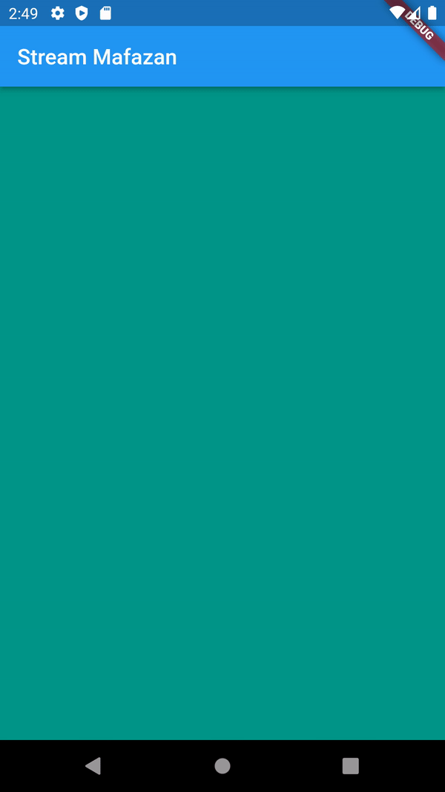
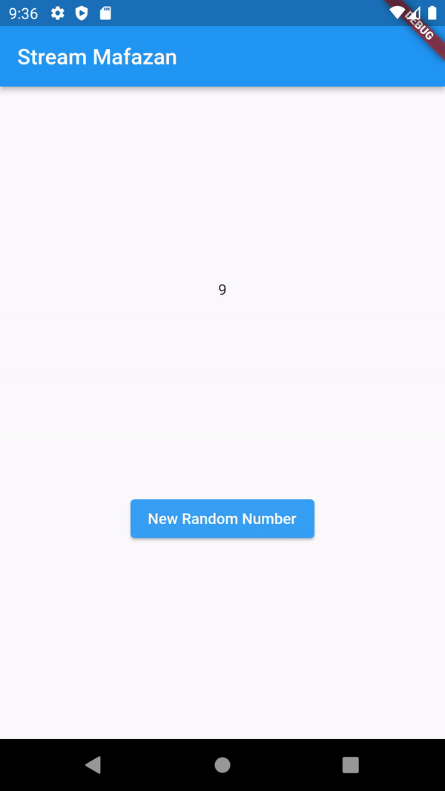

## Nama : M . Rizky Mafazan (16)
## NIM : 2141720140
## Kelas : 3F

<br>
<br>

# Week 13 - Lanjutan State Management dengan Streams

### Praktikum 1: Dart Streams


**Soal 1**

- Tambahkan nama panggilan Anda pada title app sebagai identitas hasil pekerjaan Anda.
- Gantilah warna tema aplikasi sesuai kesukaan Anda.
- Lakukan commit hasil jawaban Soal 1 dengan pesan "W13: Jawaban Soal 1"

```dart
import 'package:flutter/material.dart';

void main() {
  runApp(const MyApp());
}

class MyApp extends StatelessWidget {
  const MyApp({super.key});

  @override
  Widget build(BuildContext context) {
    return MaterialApp(
      title: 'Stream Mafazan',
      theme: ThemeData(
        primarySwatch: Colors.blue,
      ),
      home: const StreamHomePage(),
    );
  }
}

class StreamHomePage extends StatefulWidget {
  const StreamHomePage({super.key});

  @override
  State<StreamHomePage> createState() => _StreamHomePageState();
}

class _StreamHomePageState extends State<StreamHomePage> {
  @override
  Widget build(BuildContext context) {
    return Container();
  }
}

```

**Soal 2**

- Tambahkan 5 warna lainnya sesuai keinginan Anda pada variabel colors tersebut.
- Lakukan commit hasil jawaban Soal 2 dengan pesan "W13: Jawaban Soal 2"

```dart
import 'package:flutter/material.dart';

class ColorStream {
  final List<Color> colors = [
  Colors.red,
  Colors.yellow,
  Colors.blue,
  Colors.green,
  Colors.teal,
];


}

```


**Soal 3**

- Jelaskan fungsi keyword yield* pada kode tersebut!
> Keyword 'yield*' digunakan dalam metode getColors() dari kelas ColorStream untuk mendelegasikan pembuatan warna ke generator lain. 'yield*' digunakan untuk mendelegasikan pembuatan warna ke generator Stream.periodic().

- Apa maksud isi perintah kode tersebut?
> Untuk menjelaskan fungsi keyword yield* pada kode yang diberikan. Kode tersebut mendefinisikan kelas ColorStream yang memiliki metode getColors(). Metode getColors() menghasilkan aliran warna yang berubah setiap detik. Warna yang dihasilkan dipilih dari daftar warna yang disimpan dalam properti colors.

- Lakukan commit hasil jawaban Soal 3 dengan pesan "W13: Jawaban Soal 3"

**Soal 4**

- Capture hasil praktikum Anda berupa GIF dan lampirkan di README.



- Lakukan commit hasil jawaban Soal 4 dengan pesan "W13: Jawaban Soal 4"

**Soal 5**

- Jelaskan perbedaan menggunakan listen dan await for (langkah 9) !
> 'await' digunakan untuk mengambil nilai asinkron secara berurutan dalam suatu loop, sementara 'listen' digunakan untuk mendaftarkan fungsi yang akan dipanggil setiap kali ada perubahan dalam stream tanpa menghentikan eksekusi program.

- Lakukan commit hasil jawaban Soal 5 dengan pesan "W13: Jawaban Soal 5"

### Praktikum 2: Stream controllers dan sinks

**Soal 6**

- Jelaskan maksud kode langkah 8 dan 10 tersebut!
> Pada langkah 8 tersebut mencakup pengaturan awal untuk mengelola aliran data atau stream angka. Pada bagian ini, objek NumberStream dibuat dan diinisialisasi, termasuk juga pengambilan controller dari objek tersebut. Controller ini digunakan untuk mengontrol aliran data dan mendapatkan objek Stream dari controller, serta menambahkan listener ke aliran data. Dalam hal ini, ketika ada data baru yang diterima di aliran, fungsi yang ditentukan dalam blok listen akan dijalankan. Fungsi ini menggunakan setState untuk memperbarui state dengan nilai terbaru dari aliram, yang dalam konteks ini disimpan sebagai lastNumber.

> Pada Langkah 10 terdiri dari fungsi addRandomNumber(), yang bertujuan untuk menambahkan angka acak ke aliran data. Dalam fungsi ini, objek Random dibuat untuk menghasilkan angka acak antara 0 dan 9. Angka acak ini kemudian ditambahkan ke sink pada objek NumberStream. Dengan melakukan hal ini, nilai yang ditambahkan akan dikirimkan ke semua listener yang telah didaftarkan ke aliran data tersebut, sehingga memungkinkan tindakan tertentu diambil ketika ada perubahan nilai dalam aliran data.

- Capture hasil praktikum Anda berupa GIF dan lampirkan di README.



- Lalu lakukan commit dengan pesan "W13: Jawaban Soal 6".

**Soal 7**

- Jelaskan maksud kode langkah 13 sampai 15 tersebut!

> Pada kode langkah 13 sampai 15 yaitu membuat handling ketika terjadi error menggunakan metode `addError()` dalam class `stream.dart`. Dalam konteks ini, jika terjadi error atau kesalahan selama proses iterasi atau saat `stream` menghasilkann ilai, maka fungsi `addError()` dipanggil untuk menangani situasi tersebut. Sebagai hasil dari penanganan kesalahan, nilai variabel dari `lastNumber` akan diatur menjadi -1.

- Kembalikan kode seperti semula pada Langkah 15, comment addError() agar Anda dapat melanjutkan ke praktikum 3 berikutnya.
- Lalu lakukan commit dengan pesan "W13: Jawaban Soal 7".


### Praktikum 3: Injeksi data ke streams

**Soal 8**

- Jelaskan maksud kode langkah 1-3 tersebut!
- Capture hasil praktikum Anda berupa GIF dan lampirkan di README.
- Lalu lakukan commit dengan pesan "W13: Jawaban Soal 8".

### Praktikum 4: Subscribe ke stream events

**Soal 9**

- Jelaskan maksud kode langkah 2, 6 dan 8 tersebut!
- Capture hasil praktikum Anda berupa GIF dan lampirkan di README.
- Lalu lakukan commit dengan pesan "W13: Jawaban Soal 9".

### Praktikum 5: Multiple stream subscriptions

**Soal 10**

- Jelaskan mengapa error itu bisa terjadi ?

**Soal 11**

- Jelaskan mengapa hal itu bisa terjadi ?
- Capture hasil praktikum Anda berupa GIF dan lampirkan di README.
- Lalu lakukan commit dengan pesan "W13: Jawaban Soal 10,11".

### Praktikum 6: StreamBuilder

**Soal 12**

- Jelaskan maksud kode pada langkah 3 dan 7 !
- Capture hasil praktikum Anda berupa GIF dan lampirkan di README.
- Lalu lakukan commit dengan pesan "W13: Jawaban Soal 12".

### Praktikum 7: BLoC Pattern

**Soal 13**

- Jelaskan maksud praktikum ini ! Dimanakah letak konsep pola BLoC-nya ?
- Capture hasil praktikum Anda berupa GIF dan lampirkan di README.
- Lalu lakukan commit dengan pesan "W13: Jawaban Soal 13".